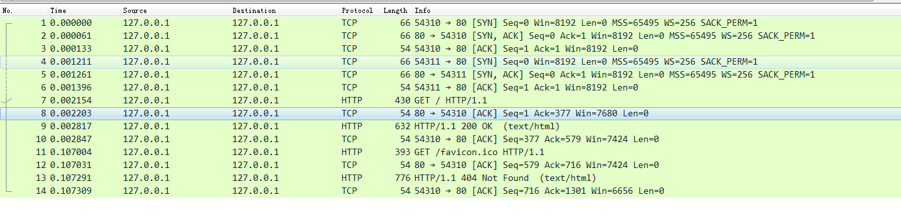

首先看一下抓取的数据包

HTTP协议运行在TCP/IP基础上，依靠TCP/IP协议来实现数据的可靠传输。因此浏览器要用HTTP协议收发数据，首先要建立TCP连接。当我们在地址栏输入网址按下回车后，浏览器首先要依照TCP协议，使用“三次握手”建立与Web服务器的连接。

#### DNS域名解析

如果输入的网址不是IP地址，而是域名，那么会触发域名解析动作，通过访问一系列的域名解析服务器，把域名翻译成TCP/IP协议里的IP地址。

在域名解析的过程中，浏览器首先看自己的缓存里有没有，如果没有就向操作系统的缓存要，操作系统的缓存也没有，就检查本机域名解析文件hosts，如果还没有，就开始访问一系列的域名解析服务器。

#### TCP连接建立

图中最开始的3个包，浏览器使用的端口是54310，服务器使用的端口是80，经过SYN、SYN/ACK、ACK的三个包之后，浏览器和服务器的TCP连接就建立了：

1. 首先浏览器向服务器发送SYN包，进入SYN_SEND状态，等待服务器确认；

2. 服务器收到syn包，必须确认浏览器的SYN（ack=j+1），同时自己也发送一个SYN包（syn=k），即SYN+ACK包，此时服务器进入SYN_RECV状态

3. 浏览器收到服务器的SYN＋ACK包，向服务器发送确认包ACK(ack=k+1)，此包发送完毕，浏览器和服务器进入ESTABLISHED状态，完成三次握手，浏览器和服务器可以开始传输数据了。

#### HTTP请求 / HTTP响应

1. TCP连接建立完成后，浏览器按照HTTP协议规定的格式，通过TCP向服务器发送"GET / HTTP/1.1" 请求报文，即图中第7个包。

2. 服务器接收到浏览器的请求报文时，回复浏览器一个ACK包，即图中第8个包。

3. 服务器按照HTTP协议规定解析报文，确认这个请求想要干什么。然后根据HTTP协议的规定发送响应报文，即第9个包，"HTTP/1.1 200 OK"。

4. 浏览器收到响应报文后，给服务器回复一个ACK包，即第10个包。随后浏览器对响应报文进行解析，最后浏览器展示响应结果。
   
   

#### 疑问

1. 域名解析过程
