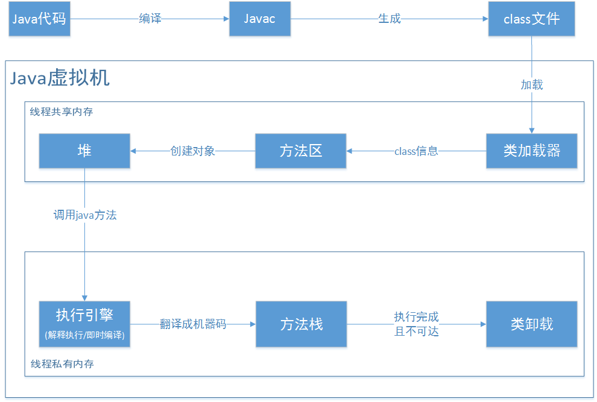

 

1. 首先通过javac编译器将java源文件(.java文件)编译为java字节码文件(.class文件)

2. 类加载将字节码文件加载到JVM中，加载后字节码文件保存在方法区中。实际运行时，JVM会执行方法区的代码。

3. 通过字节码文件创建与其对应的对象信息，并将对象信息保存在堆中。

4. 当调用对象的java方法时，JVM执行引擎会将对应方法的字节码文件通过翻译成机器码，并在当前线程的Java方法栈中生成栈帧，用以存放局部变量以及字节码操作数。

5. 对象执行完成，并且没有其他对象引用它时，则卸载该对象，释放对象占用的内存空间，删除方法区的字节码文件。
