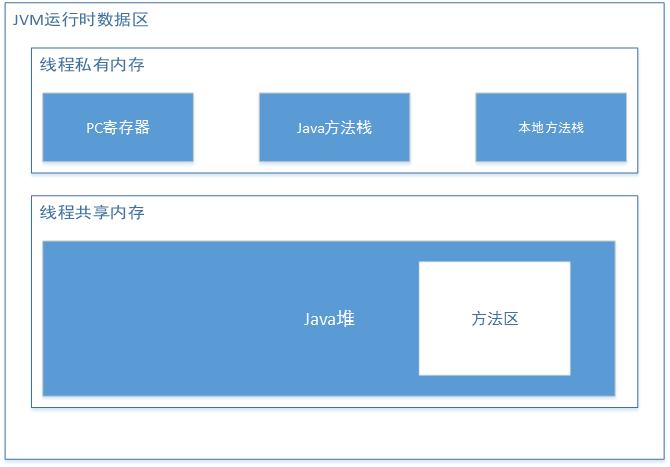

JVM定义了在程序执行期间使用的各种运行时数据区域。其中一些数据区域是在JVM启动时创建，仅在JVM退出时销毁。其他数据区域是每个线程的，线程数据区域随着线程的开始而创建，在线程结束时销毁。

## pc寄存器(pc Program counter)

用于保存JVM正在执行的字节码指令的地址。如果执行的是`native`方法，pc寄存器的值为`undefined`。

字节码解释器工作时通过改变这个计数器的值来选取下一条需要执行的字节码指令。

pc寄存器属于线程数据区域，因此其生命周期与线程相同。

## JVM栈(Java Virtual Machine Stacks)

线程在创建的同时，jvm会创建于线程对应的jvm栈，用于存储栈帧。

方法在执行的同时会创建一个栈帧用于存储局部变量表、操作数栈等信息。方法从调用到执行完成，对应着栈帧在jvm栈中入栈到出栈。

JVM栈也属于线程数据区域，其使用的内存空间可以不是连续的。

JVM栈的空间大小可以是固定的，也可以是动态扩容的。

如果是固定大小的栈，当线程请求分配的栈容量超过jvm允许的最大容量，jvm将抛出`StackOverflowError`异常。

如果jvm栈可以动态扩容，当扩展时无法申请到足够的内存或在新建线程没有足够的内存去创建对应的jvm栈时，jvm抛出`OutOfMemoryError`异常。

## 堆(Heap)

在jvm中，java堆是线程共享的运行时内存区域，在jvm启动时创建。用于存放类实例和数组对象。

java堆是垃圾收集器管理的主要区域。java堆的内存空间不是连续的，但在逻辑上是连续的。

java堆的容量可以是固定的，也可以随着程序执行动态扩展，但不会自动收缩。

如果堆中没有足够的内存完成实例分配，并且无法再扩展时，会抛出`OutOfmemoryError`异常。

## 方法区(Method Area)

方法区是线程共享的运行时内存区域，存储了每一个类的结构信息：运行时常量池、字段和方法数据、构造函数和普通方法的字节码内容等。

方法区是堆的逻辑组成部分，其实际内存空间可以是不连续的。对方法去的垃圾回收主要是对常量池的回收和对类型的卸载。

方法去的容量可以是固定的，也可以是动态扩展，但不会自动收缩。当方法区无法满足内存分配需求时，将抛出OutOfMemoryError异常。

## 运行时常量池(Runtime Constant Pool)

运行时常量池是class文件中类或接口的常量池表的运行时表示形式，包括了编译期生成的字面量和运行期解析后才能获得的方法或字段引用。

运行时常量池是在方法区中分配，在加载类和接口到JVM后，就创建对应的运行时常量。

当创建类或接口时，如果构造运行时常量池所需的内存空间超过方法区的最大值，将会抛出OutOfMemoryError异常。

## 本地方法栈(Native Method Stack)

JVM使用传统栈(C stack)来执行native方法，这个传统栈就是本地方法栈。如果虚拟机不支持native方法，则可以不提供本地方法栈。

本地方法栈可以是固定大小，也可以时动态扩容或收缩。

如果线程请求分配的栈容量超过本地方法最大值，JVM将抛出StackoverflowError。

如果本地方法栈是动态扩容的，并且在尝试扩展时无法申请到足够的内存，或在创建新线程时没有足够的内存去创建对应的本地方法栈，Java虚拟机将会抛出OutOfMemoryError

