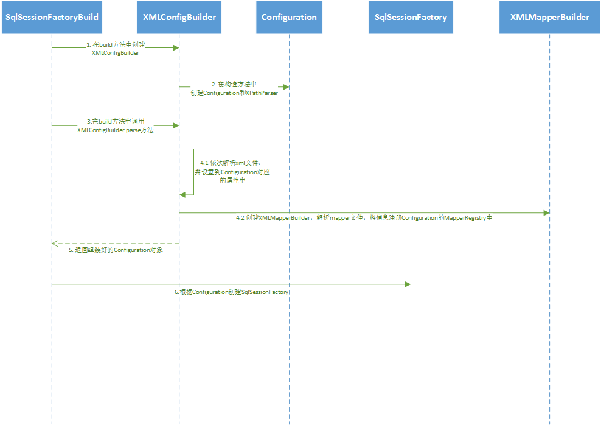
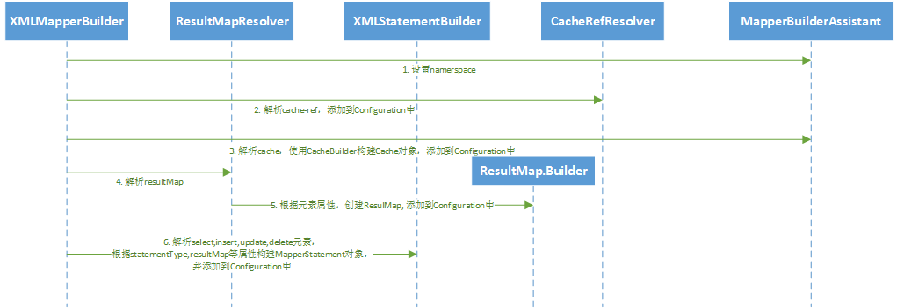

`SqlSessionFactory`初始化过程就是根据`mybatis-config.xml`的配置来组装成`Configuration`对象的过程。

### mybatis配置文件与Configuration的对应

1. `<properties>`元素对应`Configuration`的`variables`属性

2. `<typeAliases>`元素对应`Configuration`的`typeAliasRegistry`属性

3. `<plugins>`元素对应`Configuration`的`interceptorChain`属性

4. `<objectFactory>`元素对应`Configuration`的`objectFactory`属性

5. `<objectWrapperFactory>`元素对应`Configuration`的`objectWrapperFactory`属性

6. `<reflectorFactory>`元素对应`Configuration`的`reflectorFactory`属性

7. `<environments>`元素对应`Configuration`的`environment`属性

8. `<typeHandlers>`元素对应`Configuration`的`typeHandlerRegistry`属性

9. `<mappers>`元素对应`Configuration`的`mapperRegistry`属性

### 流程图

1. `SqlSessionFactoryBuilder`创建`XMLConfigBuilder`对象，调用`XMLConfigBuilder.parse()`;

2. `XMLConfigBuilder`创建`Configuration`实例，并使用`parseConfiguration`方法对配置文件进行解析组装`Configuration`的属性，然后返回`Configuration`；
   
   2.1 使用`XMLMapperBuilder`对`mapper`映射文件进行解析；

3. `SqlSessionFactoryBuilder`根据`Configuration`创建DefaultSqlSessionFactory，并返回。

### Mapper映射文件的解析

Mapper映射文件的解析工作是由XMLMapperBuilder对象来完成的。

#### 流程图

